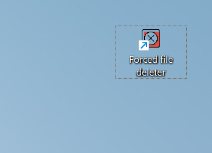
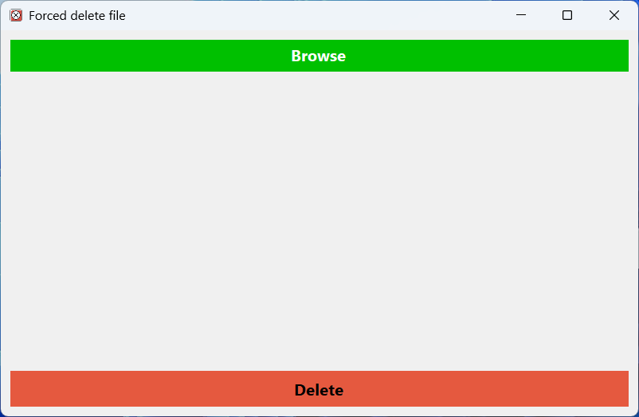
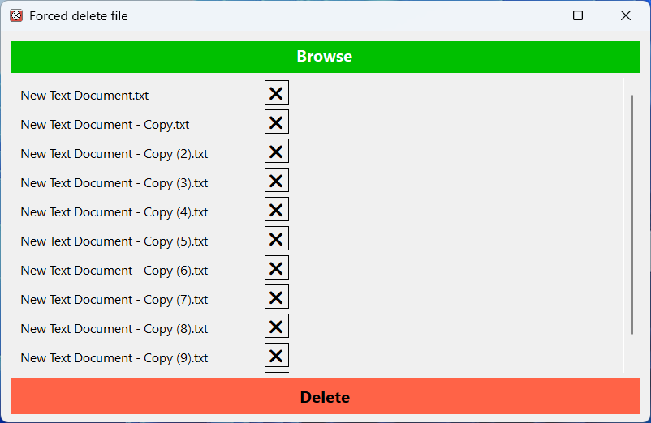

# 🗑️ ForcedFileDeleter

**ForcedFileDeleter** is a lightweight Windows desktop application that allows you to force delete or schedule deletion of locked/in-use files — even from system-protected folders like `Program Files`.

---

## 🚀 Features

✅ Select multiple files  
✅ Delete unlocked files immediately  
🔁 Schedule locked files for deletion on next reboot  
🛑 Automatically clears deleted files from UI  
🖱️ Intuitive scrollable interface with per-file removal  
🔐 Handles access denied and read-only file scenarios

---

## 💡 Use Case

Ever been stuck trying to delete a DLL, EXE, or system temp file that's locked by another process (like IDM or antivirus)?  
**FileForceDeleter** helps you:
- Kill stubborn files
- Clean up after uninstallations
- Delete malware remnants or broken setups

---

## 🖥️ Screenshots

### Desktop Shortcut icon

### Main Interface

### After Browersing

### After Deleting

---

## 🛠️ Built With

| Tool / Library | Purpose                        |
|----------------|--------------------------------|
| C# .NET WinForms | Desktop application UI       |
| `MoveFileEx` (kernel32.dll) | Schedules file deletion on reboot |
| Visual Studio 2022+ | Development environment     |

---

## 📦 How to Use

1. 🔍 Click **Browse Files** to select one or more files
2. 🗑️ Click **Delete Selected**
3. ✅ Files will be:
   - Deleted immediately (if possible)
   - Or 🔁 scheduled for deletion on the next system restart
4. 💡 You'll be prompted to reboot if necessary

---

## ⚠️ Notes

- Always **run the application as Administrator** to handle protected files.
- Scheduled deletions require a **Windows reboot** to take effect.
- Be careful deleting system-critical files — this tool doesn't validate their importance.

---

## 🙌 Credits

Created by a .NET backend developer focused on solving real-world file access issues.  
Need a contributor or want to fork it? PRs welcome!

---

## 📄 License

MIT — free to use, fork, and enhance.

